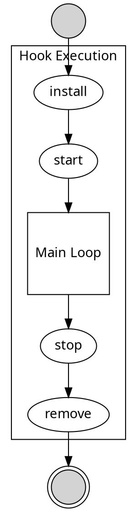

## Charm Lifecycle

Broadly, eliding several details:

----

# Triggers

| Event | Hook(s) Triggered  | Extra details
|----|----|---|
| Timer  | <li> `update-status` | Frequency set by `update-status-hook-interval` configuration parameter. See [Configuring Models](https://jaas.ai/docs/configuring-models)
| Timer  | <li> `collect-metrics` | 
| `juju attach-storage <unit> <name>` | <li> `<name>-storage-attached`
| `juju detach-storage <name>` | <li> `<name>-storage-detaching`
| Machine startup | <li> `start` | Coming in Juju 2.8.0.
| `juju add-unit` | <li> `<rel>-relation-joined` <li> `<rel>-relation-changed` | Only the first unit of a new application triggers a `-relation-joined` hook.
