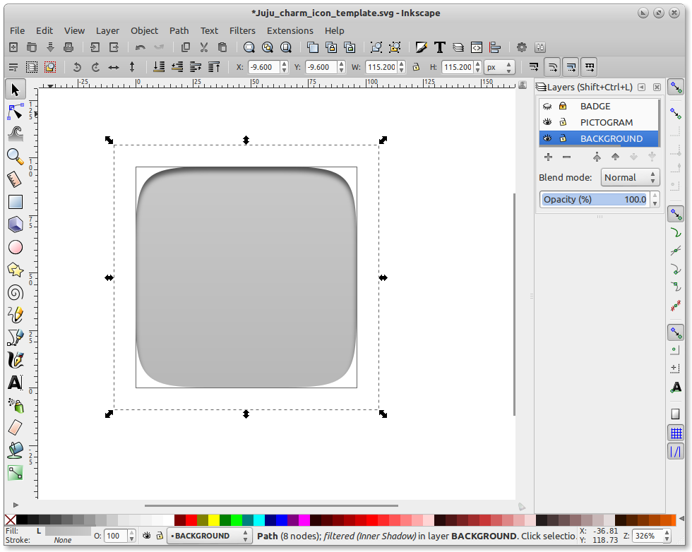
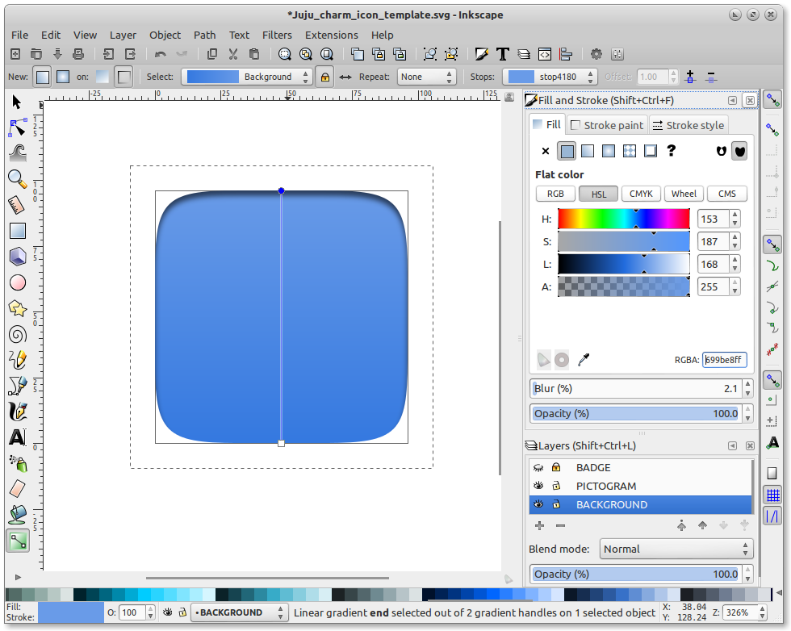
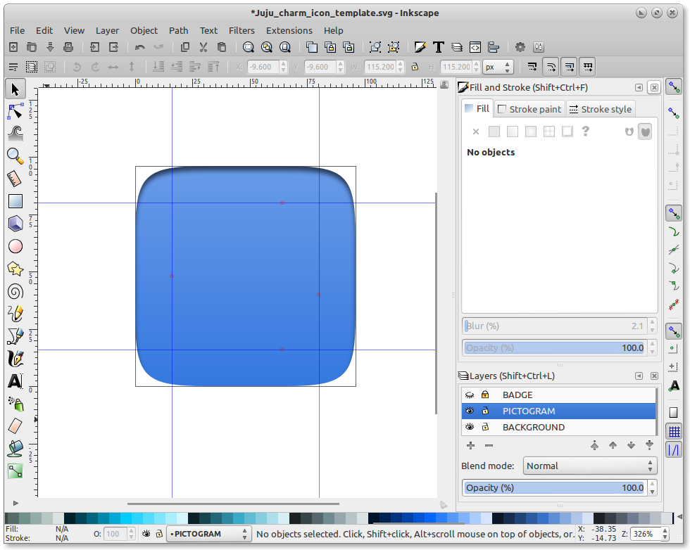

Title: Creating icons for charms

# Creating icons for charms

In order to make your charm recognisable in the Charm Store, it is best
practice to add a unique and recognisable icon for it. This isn't as hard as it
may seem, as this step by step guide will demonstrate.

## Icon specifications

Before we start actually making the icon though, we should be aware of the
specifications required by the charm store. This is to ensure a consistent
experience for the users, and icons failing to meet this spec will be rejected.

A charm icon is an SVG format image where the canvas size is 100x100 pixels. It
consists of a circle with a flat color and a logo.

There is no specification to design the logo: it can be a white (or black)
monochromatic symbol, a colored logo, or whatever is best. However, it's best to
leave some padding between the edges of the circle and the logo.

## Creating an icon

If meeting the above spec seems more complicated than creating your charm in the
first place, then fear not, because we have an easy step-by-step guide for you.
Before you start you will need:

  - A vector graphic editor. We strongly recommend the cross-platform and most excellent [ Inkscape ](http://www.inkscape.org) for all your vector graphic needs.
  - [The template file.](../media/icon.svg) (right-click > Save link as...)
  - An existing logo you can import, or the ability to draw one in Inkscape.

Once you have those, fire up Inkscape and we can begin!

## Open the template!

From Inkscape load the **icon.svg** file. Select the Layer called "Background Circle",
either from the drop down at the bottom, or from the layer dialog.

## Add colour

Select **Object** and then **Fill and Stroke** from the menu to adjust the
color.

## Draw something

Draw your shape within the circle. If you already have a vector logo, you can
import it and scale it within the guides. Inkscape also has plenty of drawing
tools for creating complex images.

If you import a bitmap image to use, be sure to convert it into a vector file
and delete the bitmap.

*Cloud icon: "Cloud by unlimicon from the Noun Project" [CC BY]*

## And finally... some quick Dos and Don'ts

Icons should not be overly complicated. Charm icons are displayed in various
sizes (from 160x160 to 32x32 pixels) and they should be always legible. In
Inkscape, the ‘Icon preview’ tool can help you to check the sharpness of your
icons at small sizes.

Symbols should have a similar weight on all icons: avoid too thin strokes and
use the whole space available to draw the symbol within the limits defined by
the padding. However, if the symbol is much wider than it is high, it may
overflow onto the horizontal padding area to ensure its weight is consistent.

Do not use glossy materials unless they are parts of a logo that you are not
allowed to modify.
