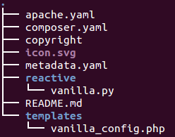

Title: Writing layer example

# Writing a layer by example

In this document, we will be writing a charm layer that installs and
configures the [Vanilla forum software][].

> Vanilla is an open source, themeable, pluggable, and multi-lingual forum
> software, which enables communities to host a forum for discussion topics
> at scale. Powered by PHP and MySQL, Vanilla is a fine example of a
> three-tiered application:
>
> - Database (MySQL)
> - Middleware (PHP App)
> - Load Balancing via HTTP interface

## Prepare your workspace

Building off of [`$JUJU_REPOSITORY`][JUJU_REPOSITORY],
we want to add two more environment variables to your session. We recommend
adding these into your shell configuration file so that they are always
available.

### LAYER_PATH

First off, you require a [local charm repository][charms-deploying] in
which to work. This involves creating three directories -- `layers`,
`interfaces`, and `charms` -- and setting some environment variables.

The `layers` directory contains the source code of the layered charm covered in
our examples. The `interfaces` directory is where you'd place any
[interface-layers][interface-layers] you may wish to write, and the
`charms` directory holds the assembled, ready to deploy charm.

```bash
export JUJU_REPOSITORY=$HOME/charms
export LAYER_PATH=$JUJU_REPOSITORY/layers
export INTERFACE_PATH=$JUJU_REPOSITORY/interfaces

mkdir -p $LAYER_PATH $LAYER_PATH/vanilla

cd $LAYER_PATH/vanilla
```

!!! Note:
    Exporting the environment variables in this way only sets the
    variables for the current terminal. If you wish to make these changes persist,
    add the same export statements to a resource file that are evaluated when you
    create a new console such as ~/.bashrc depending on your shell.

### Charm Tools

Charm Tools is add-on software that is necessary for charm building. See
[Charm Tools][charm-tools] for information on installation and usage.

## Determine a base layer and additional relations

To best leverage existing work, it is important to choose the right base layer
for your charm.  The available layers and interfaces can be found at
[interfaces.juju.solutions][].

In our case, Vanilla is a PHP5 application, so the layer we will use is the
[apache-php5][] layer.  This is a "runtime" layer that provides a common basis
for specific applications to built on top of.  Out of the box, this will give
us Apache2 running on a configurable port, mod-php5, and support for the
[http interface][] for running behind a proxy for high availability and scaling.

On top of that, we'll want to use the [mysql interface][].

We will put these in a `layer.yaml` file, which tells the builder what layers
and interfaces to combine with yours to create the finished charm:

```yaml
includes: ['layer:apache-php', 'interface:mysql']
```

## Fill in your charm layer

With that decided, we're ready to start creating our charm layer. The README,
icon, and copyright file will be the same. The `metadata.yaml` will be the same
except that the `website` relation will be managed for us, so we can leave out
the `provides` section:

```yaml
name: vanilla
summary: Vanilla is an open-source, pluggable, themeable, multi-lingual forum.
maintainer: Your Name <your@email.tld>
description: |
  Vanilla is designed to deploy and grow small communities to scale.
  This charm deploys Vanilla Forums as outlined by the Vanilla Forums installation guide.
tags:
  - social
requires:
  database:
    interface: mysql
```

The `apache-php` layer requires some additional configuration to tell it how to
install and configure your application. This goes in an `apache.yaml` file:

```yaml
packages:
  - 'php5-mysql'
  - 'php5-gd'
sites:
  vanilla:
    options: 'Indexes FollowSymLinks MultiViews'
    install_from:
      source: https://github.com/vanillaforums/Garden/archive/Vanilla_2.0.18.8.tar.gz#sha256=acf61a7ffca9359c1e1d721777182e51637be59744925935291801ccc8e8fd55
```

This tells the `apache-php` layer to install some additional packages for PHP,
where to fetch your application from (as well as its cryptographic hash to
verify the payload), and a few options for the vhost entry.  The application
will be installed under `/var/www/{site_name}` where `{site_name}` is the name
of the block under `sites` (in this case `vanilla`).

Finally, we're ready to work on the charm implementation.

## Implementing your layer

The `apache-php` layer and `mysql` interface use [charms.reactive][] to
coordinate with your layer.  This makes it easy to coordinate the state
of multiple layers, relations, configuration options, etc.  Code for
reactive handlers should live under a `reactive/` folder in your charm layer.
In our case, we'll use `reactive/vanilla.py`.  (We're using Python in this
example, but a Bash version would look [substantially similar][reactive-bash]).

The `apache-php` layer sets an `apache.available` state when your application
is done being installed, and the `mysql` interface sets a similar
`{relation_name}.available` state (where `{relation_name}` depends on what you
called the relation in your `metadata.yaml`) to indicate that MySQL has
provided you with a complete set of database credentials.

Thus, by watching for both of those states, you can easily tell when the right
time to set up your application is:

```python
@when('apache.available', 'database.available')
def setup_vanilla(mysql):
    pass
```

You'll notice that the MySQL relation is passed in so that you can easily access
the database connection information.

Since the Apache installation and MySQL relation negotiation are all handled for
us, the only thing left to do is create the `conf/config.php` file for Vanilla.
To make things easy, we will render a template to populate the values.  We'll
also handle a few more state changes to provide better status reporting and
react to our database going away in an intelligent manner:

```python
import pwd
import os
from subprocess import call
from charmhelpers.core.hookenv import status_set
from charmhelpers.core.templating import render
from charms.reactive import when, when_not
from charms.reactive import set_state, remove_state


@when('apache.available', 'database.available')
def setup_vanilla(mysql):
    render(source='vanilla_config.php',
           target='/var/www/vanilla/conf/config.php',
           owner='www-data',
           perms=0o775,
           context={
               'db': mysql,
           })
    uid = pwd.getpwnam('www-data').pw_uid
    os.chown('/var/www/vanilla/cache', uid, -1)
    os.chown('/var/www/vanilla/uploads', uid, -1)
    call('chmod -R 777 /var/www/vanilla/conf'.split(), shell=False)
    set_state('apache.start')
    status_set('maintenance', 'Starting Apache')


@when('apache.available')
@when_not('database.connected')
def missing_mysql():
    remove_state('apache.start')
    status_set('blocked', 'Please add relation to MySQL')


@when('database.connected')
@when_not('database.available')
def waiting_mysql(mysql):
    remove_state('apache.start')
    status_set('waiting', 'Waiting for MySQL')


@when('apache.started')
def started():
    status_set('active', 'Ready')
```

By setting the `apache.start` flag, we are letting the `apache-php` layer know
that we have finished configuring the application and it is ready to start.

The `templates/vanilla_config.php` file is straightforward:

```php
<?php if (!defined('APPLICATION')) exit();
$Configuration['Database']['Host'] = '{{ db.host() }}';
$Configuration['Database']['Name'] = '{{ db.database() }}';
$Configuration['Database']['User'] = '{{ db.user() }}';
$Configuration['Database']['Password'] = '{{ db.password() }}';
?>
```

And that's all you need to get Vanilla up and running using layers!
The final directory structure looks like this:



Check out the [repo][] for the complete charm layer.

It's worth noting that there is a file for each layer in the `reactive`
directory.  This allows the handlers for each layer to remain separate and
not conflict.  All handlers from each of those files will be discovered and
dispatched according to the [discovery and dispatch rules][].

## Building your charm

Now that the layer is done, let's build it together and deploy the final
charm.  From within the layer directory, this is as simple as:

```bash
charm build .
```

Build will take all of the layers, looking first in your local LAYER_PATH and
then querying [interfaces.juju.solutions][], and
create a new charm into `$JUJU_REPOSITORY/trusty/vanilla`:

```
build: Composing into /home/user/charms
build: Processing layer: layer:basic
build: Processing layer: layer:apache-php
build: Processing layer: .
```

Then we can deploy mysql and our new charm as usual:

```bash
juju deploy mysql
juju deploy $JUJU_REPOSITORY/trusty/vanilla
juju add-relation mysql vanilla
juju expose vanilla
```

[http interface]: https://github.com/juju-solutions/interface-http
[Vanilla forum software]: https://vanillaforums.org/
[apache-php5]: https://github.com/johnsca/apache-php
[mysql interface]: https://github.com/johnsca/juju-relation-mysql
[charms.reactive]: https://charmsreactive.readthedocs.io/
[reactive-bash]: https://charmsreactive.readthedocs.io/en/latest/bash-reactive.html
[repo]: https://github.com/johnsca/layered-vanilla
[interfaces.juju.solutions]: https://interfaces.juju.solutions/
[discovery and dispatch rules]: https://charmsreactive.readthedocs.io/#discovery-and-dispatch-of-reactive-handlers
[charm-tools]: ./tools-charm-tools.html
[JUJU_REPOSITORY]: ./reference-environment-variables.html#juju_repository
[charms-deploying]: ./charms-deploying.html
[interface-layers]: ./developer-layers-interfaces.html