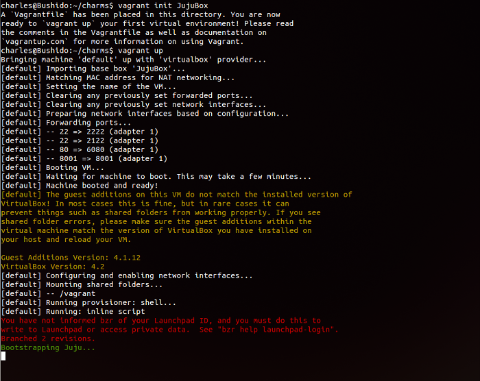
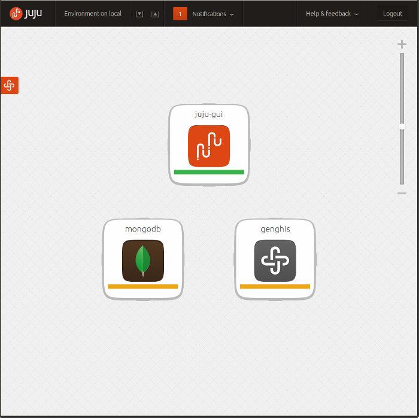

[  Juju
](https://juju.ubuntu.com/)

  - Jump to content
  - [Charms](https://juju.ubuntu.com/charms/)
  - [Features](https://juju.ubuntu.com/features/)
  - [Deploy](https://juju.ubuntu.com/deployment/)
  - [Resources](https://juju.ubuntu.com/resources/)
  - [Community](https://juju.ubuntu.com/community/)
  - [Install Juju](https://juju.ubuntu.com/download/)

Search: Search

## Juju documentation

LINKS

#  Vagrant Juju Workflow on OSX

Developing charms on Ubuntu is an extremely straight forward process thanks to
the addition of the local provider. LXC containers spin up quickly, integrate
directly into your desktop OS, and leave you with very little configuration
needed out of the box to get started.

What about users on OSX? What's their developer story like? The technical
limitation is that OS X does not support operating system-level virtualization,
like containers in Linux. The next best thing is to use a virtualization wrapper
solution like [Vagrant](config-vagrant.html)!

##  Getting Started

To start you will want to ensure you've got the following tools installed on
your development machine:

  - [Homebrew](http://brew.sh)
  - [Vagrant](http://vagrantup.com)
  - [VirtualBox](https://www.virtualbox.org/)
  - [Juju](http://juju.ubuntu.com)

### Fetching the boxfile

Head over to the [Juju Vagrant](config-vagrant.html) provider documentation.
We'll need to fetch the latest basebox for Vagrant. I recommend using the
precise basebox.

    
    
    vagrant box add JujuBox http://cloud-images.ubuntu.com/vagrant/precise/current/precise-server-cloudimg-amd64-juju-vagrant-disk1.box
    

This process takes a short while to complete, as its downloading a 200mb virtual
machine image. Once its complete you can verify everything completed correctly
by listing out the boxes that vagrant is tracking.

    
    
    vagrant box list
    

If you see __JujuBox__ listed, we're ready to proceed to the next step.

###  Preparing our local charm repository

We will need to create a directory structure that reflects the current standard
for juju charm repositories. I recommend putting this in $HOME

    
    
    mkdir -p ~/charms/precise
    

Feel free to add any other LTS based target directory, for example if you were
to target Trusty Tahr as a release for your charm, the command would be

    
    
    mkdir -p ~/charms/trusty
    

For the remainder of this tutorial, I will assume we are targeting Precise, as
its the current LTS target of choice.

###  Installing Charm-Tools

Now is a good time to fetch Charm Tools. But what are charm tools you ask?

> Charm Tools offer a means for users and charm authors to create, search,
fetch, update, and manage charms.

These can be installed via homebrew.

    
    
    brew install charm-tools
    

##  Creating our first charm

Lets charm up [GenghisApp](http://genghisapp.com/) \- a single file MongoDB
adminsitration app.

    
    
    cd charms/precise
    charm create genghis
    

This will create a skeleton structure of a charm ready for you to edit and
populate with your services deployment and orchestration logic.

    
    
    ├── config.yaml
    ├── copyright
    ├── hooks
    │   ├── config-changed
    │   ├── install
    │   ├── restart
    │   ├── start
    │   ├── stop
    │   ├── upgrade-charm
    │   └── website-relation-joined
    ├── icon.svg
    ├── metadata.yaml
    ├── README
    └── revision
    

### Writing the Charm

We'll start by editing the metadata.yaml to populate the information about our
charm.

    
    
    name: genghisapp
    summary: Genghisapp the single file MongoDB administration tool
    maintainer: Charles Butler <chuck@dasroot.net>
    description: |
       deploys the genghisapp gem, defaults to running on port 80. No additional relations are required to speak to the MongoDB Service. All data relating to the connection is stored in the browser Local Storage engine.
    categories:
      - app
    subordinate: false
    provides:
      website:
       interface: http
    

Now that juju knows something about our service we're ready to start writing the
hooks.

####  Install Hook

    
    
    #!/bin/bash
    set -ex
    
    apt-get install -y ruby1.9.3 rubygems
    update-alternatives --set ruby /usr/bin/ruby1.9.1
    update-alternatives --set gem /usr/bin/gem1.9.1
    HOME=/root gem install genghisapp bson_ext --no-ri --no-rdoc
    

####  Config-Changed Hook

    
    
    #!/bin/bash
    
    set -ex
    
    hooks/stop
    sleep 2
    hooks/start
    

####  Start Hook

    
    
    #!/bin/bash
    
    set -ex
    
    PORT=`config-get port`
    
    if [ ! -f /root/.vegas/genghisapp/genghisapp.pid ] ; then
        HOME=/root genghisapp -L -p $PORT
    fi
    
    open-port $PORT
    

####  Stop Hook

    
    
    #!/bin/bash
    
    set -ex
    
    HOME=/root genghisapp -K
    

### Preparing Vagrant

Since vagrant is going to be our working environment, we'll want to make sure
its aware of all our charms; not just the current charm we are working on.

    
    
    cd ~/charms
    vagrant init JujuBox
    vagrant up
    

You now have a Juju installation ready to be used for testing your charm on OSX,
and an instance of Juju-Gui to interface with your services. Validate that the
GUI is accessible from <http://localhost:6080>

__Note:__ The password is output in your console feedback from the juju
bootstrap.

__Note:__ All your charms in $HOME/charms are available in the /vagrant
directory of our JujuBox

### Deploying our charm in vagrant

You'll need to enter the juju environment we just bootstrapped in $HOME/charms

    
    
    vagrant ssh
    juju deploy mongodb
    juju deploy --repository=/vagrant local:genghis
    

We are now free to watch progress through the GUI

When the Genghis badge turns green, we are ready to vpn our traffic through the
vagrant image and interface with the Genghis server

### Routing traffic with sshuttle

Ensure that you have sshuttle installed

    
    
    brew install sshuttle
    sshuttle -r vagrant@localhost:2222 10.0.3.0/24
    

__Note:__ You can skip the brew install line if you already have sshuttle
installed

__Note:__ If your local network is using 10.0.3.x you will need to alter the
Juju networking in the vagrant box, and substitute the network provided in the
command above

When prompted for the password enter `vagrant` and you should see output similar
to the following:

Now we are free to connect to genghis. Open up the Genghis running unit list and
click on the Genghis host, then click on the port 80 link in the service detail.

##  Iterating

With vagrant fully setup, our charm deployed. We can now iterate over our charm
and update/test via normal means.

  - Make edits on your HOST in your favorite editor
  - run commands inside the JujuBox vagrant environment. `juju upgrade-charm genghis`
  - view results in our HOST browser of choice.

    - ## [Juju](/)

      - [Charms](/charms)
      - [Features](/features)
      - [Deployment](/deployment)
    - ## [Resources](/resources)

      - [Overview](/resources/juju-overview/)
      - [Documentation](/docs/)
      - [The Juju web UI](/resources/the-juju-gui/)
      - [The charm store](/docs/authors-charm-store.html)
      - [Tutorial](/docs/getting-started.html#test)
      - [Videos](/resources/videos/)
      - [Easy tasks for new developers](/resources/easy-tasks-for-new-developers/)
    - ## [Community](/community)

      - [Juju Blog](/community/blog/)
      - [Events](/events/)
      - [Weekly charm meeting](/community/weekly-charm-meeting/)
      - [Charmers](/community/charmers/)
      - [Write a charm](/docs/authors-charm-writing.html)
      - [Help with documentation](/docs/contributing.html)
      - [File a bug](https://bugs.launchpad.net/juju-core/+filebug)
      - [Juju Labs](/labs/)
    - ## [Try Juju](https://jujucharms.com/sidebar/)

      - [Charm store](https://jujucharms.com/)
      - [Download Juju](/download/)

(C) 2013 Canonical Ltd. Ubuntu and Canonical are registered trademarks of
[Canonical Ltd](http://canonical.com).

