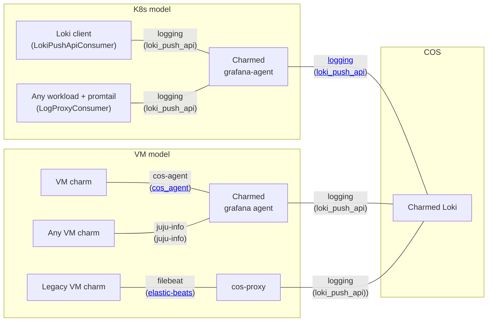

sed-i | 2024-04-17 17:33:51 UTC | #1

In COS Lite, Grafana Loki is the storage and querying backend for logs. Loki is optimised for write performance (ingestion speed), at the cost of slower random reads. This means that filtering structured logs by labels is fast, but full-text search is slower.

Log lines must be pushed into Loki, as Loki does not actively collect anything on its own.

Charmed operators are programmed to automatically add [juju topology labels](/t/juju-topology-labels/8874) to all telemetry, including logs. This enables to differentiate telemetry and associated alerts, if you happen to have multiple deployments of the same application.

## Send logs to Loki

In a typical COS Lite deployment, Loki would be running in a separate model from the monitored applications. While charms can we related directly to Loki using multiple cross-model relations (CMRs), we recommend funnelling all model telemetry through regular in-model relations to grafana agent, and only one CMR from grafana agent to Loki.



### Send logs from k8s charms
Depending on your workload, you could choose one of the following [charm libraries](https://charmhub.io/loki-k8s/libraries/loki_push_api):
- `LokiPushApiConsumer`, for workloads that can speak Loki's push api.
- `LogProxyConsumer`, which would automatically inject a promtail binary into the workload containers of interest.
- `LogForwarder`: This object can be used by any Charmed Operator which needs to send the workload standard output (stdout) through Pebble's log forwarding mechanism.

#### Example: postgresql
[Charmed postgresql-k8s](https://charmhub.io/postgresql-k8s) is [using LogProxyConsumer](https://github.com/canonical/postgresql-k8s-operator/blob/978080424255e109c7a7c4f4d23a5b3d5aba12a6/src/charm.py#L188) to tell promtail to [collect logs from](https://github.com/canonical/postgresql-k8s-operator/blob/978080424255e109c7a7c4f4d23a5b3d5aba12a6/src/constants.py#L23):
```text
[
    "/var/log/pgbackrest/*",
    "/var/log/postgresql/patroni.log",
    "/var/log/postgresql/postgresql*.log",
]
```

When related to loki,
```yaml
bundle: kubernetes
applications:
  loki:
    charm: loki-k8s
    channel: edge
    scale: 1
    trust: true
  pgsql:
    charm: postgresql-k8s
    channel: 14/edge
    scale: 1
    trust: true
relations:
- - pgsql:logging
  - loki:logging
```

this results in an auto-render promtail config file with three scrape jobs, one for each "filename":
```bash
$ juju ssh --container postgresql pgsql/0 cat /etc/promtail/promtail_config.yaml
```

```yaml
clients:
- url: http://loki-0.loki-endpoints.test.svc.cluster.local:3100/loki/api/v1/push
positions:
  filename: /opt/promtail/positions.yaml
scrape_configs:
- job_name: system
  static_configs:
  - labels:
      __path__: /var/log/pgbackrest/*
      job: juju_test_6a8318db_pgsql
      juju_application: pgsql
      juju_charm: postgresql-k8s
      juju_model: test
      juju_model_uuid: 6a8318db-33e9-487b-8065-4d95bfdabbdb
      juju_unit: pgsql/0
    targets:
    - localhost
  - labels:
      __path__: /var/log/postgresql/patroni.log
      job: juju_test_6a8318db_pgsql
      juju_application: pgsql
      juju_charm: postgresql-k8s
      juju_model: test
      juju_model_uuid: 6a8318db-33e9-487b-8065-4d95bfdabbdb
      juju_unit: pgsql/0
    targets:
    - localhost
  - labels:
      __path__: /var/log/postgresql/postgresql*.log
      job: juju_test_6a8318db_pgsql
      juju_application: pgsql
      juju_charm: postgresql-k8s
      juju_model: test
      juju_model_uuid: 6a8318db-33e9-487b-8065-4d95bfdabbdb
      juju_unit: pgsql/0
    targets:
    - localhost
server:
  grpc_listen_port: 9095
  http_listen_port: 9080
```

### Send logs from VM (“machine”) models

Use charmed [grafana-agent](https://charmhub.io/grafana-agent), which is a subordinate charm.
- When related over `juju-info`, it will pick up all logs from `/var/log/*` without any additional setup.
- When related over `cos-agent`, it will collect the logs specified in charm code, as well as built-in alert rules and dashboards.
#### Example: nova-compute
[nova-compute](https://charmhub.io/nova-compute) does not make use of the charm libraries provided by charmed loki, so the method of integration is over the `juju-info` interface.

```yaml
series: jammy
applications:
  agent:
    charm: grafana-agent
    channel: edge
  nc:
    charm: nova-compute
    channel: yoga/stable
    num_units: 1
relations:
- - agent:juju-info
  - nc:juju-info
```

This results in an auto-generated `grafana-agent.yaml` config file with juju topology labels and the default scrape jobs for `/var/log/**/*log` and `journalctl`:

```bash
$ juju ssh agent/0 cat /etc/grafana-agent.yaml
```
```yaml
integrations:
  agent:
    enabled: true
    relabel_configs:
    - regex: (.*)
      replacement: juju_test_608018cd-d625-40c8-8e27-8ac7eef7d94f_agent_self-monitoring
      target_label: job
    - regex: (.*)
      replacement: juju_f7d94f_0_lxd
      target_label: instance
    - replacement: grafana-agent
      source_labels:
      - __address__
      target_label: juju_charm
    - replacement: test
      source_labels:
      - __address__
      target_label: juju_model
    - replacement: 608018cd-d625-40c8-8e27-8ac7eef7d94f
      source_labels:
      - __address__
      target_label: juju_model_uuid
    - replacement: agent
      source_labels:
      - __address__
      target_label: juju_application
    - replacement: agent/0
      source_labels:
      - __address__
      target_label: juju_unit
  node_exporter:
    # ...
  prometheus_remote_write: []
logs:
  configs:
  - clients: []
    name: log_file_scraper
    scrape_configs:
    - job_name: varlog
      pipeline_stages:
      - drop:
          expression: .*file is a directory.*
      static_configs:
      - labels:
          __path__: /var/log/**/*log
          instance: juju_f7d94f_0_lxd
          juju_application: agent
          juju_model: test
          juju_model_uuid: 608018cd-d625-40c8-8e27-8ac7eef7d94f
          juju_unit: agent/0
        targets:
        - localhost
    - job_name: syslog
      journal:
        labels:
          instance: juju_f7d94f_0_lxd
          juju_application: agent
          juju_model: test
          juju_model_uuid: 608018cd-d625-40c8-8e27-8ac7eef7d94f
          juju_unit: agent/0
      pipeline_stages:
      - drop:
          expression: .*file is a directory.*
  positions_directory: ${SNAP_DATA}/grafana-agent-positions
metrics:
  # ...
server:
  log_level: info
```
### Send logs from legacy charms
Legacy charms are charms that do not have COS relations in place, and are using older, "legacy" relations instead, such as "http", "prometheus", etc. Legacy charms relate to COS via the [cos-proxy](https://charmhub.io/cos-proxy) charm.

### Send logs manually (no-juju solution)
You can set up [any client](https://grafana.com/docs/loki/latest/send-data/) that can speak Loki's [push api], for example: [grafana-agent snap](https://snapcraft.io/grafana-agent).

## Inspecting log lines ingested by Loki

### Manually querying Loki API endpoints

You can [query loki](/t/loki-k8s-docs-http-api/13440) to obtain logs via [HTTP API](https://grafana.com/docs/loki/latest/reference/api/#query-logs-within-a-range-of-time).

### Displaying in a grafana panel
A Loki [datasource](https://grafana.com/docs/grafana/latest/datasources/loki/) is automatically created in grafana when a relation is formed [between loki and grafana](https://charmhub.io/interfaces/grafana_datasource).

You can visualise logs in grafana using [LogQL expressions](https://grafana.com/docs/loki/latest/query/). Grafana does not keep a copy of the Loki database. It queries loki for data, based on the `expr` in the panels.

## Retention policy for logs in Loki

Loki does not have a size-based retention policy. Instead, they rely on a retention period. This makes sense from operational approach standpoint, especially since the design assumption is that user would be using S3 storage.

The default retention period is 30 days. At the moment the loki charmed operator does not support modifying this.


[push api]: https://grafana.com/docs/loki/latest/reference/api/

## References
- [Collect logs with Promtail](https://grafana.com/docs/grafana-cloud/send-data/logs/collect-logs-with-promtail/)
- [Collect logs with Grafana Agent](https://grafana.com/docs/grafana-cloud/send-data/logs/collect-logs-with-agent/)
- [Loki HTTP API][push api]

-------------------------

