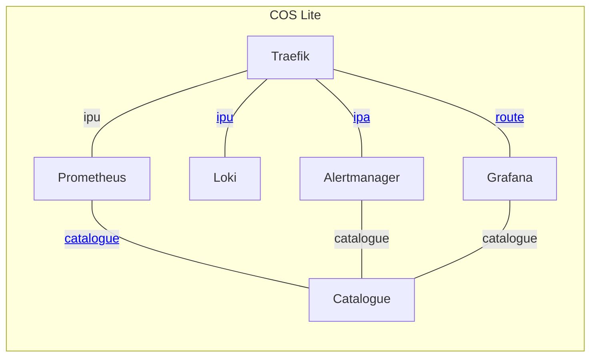
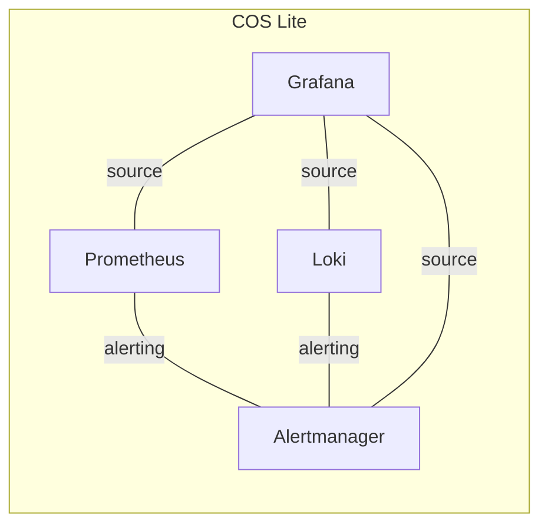
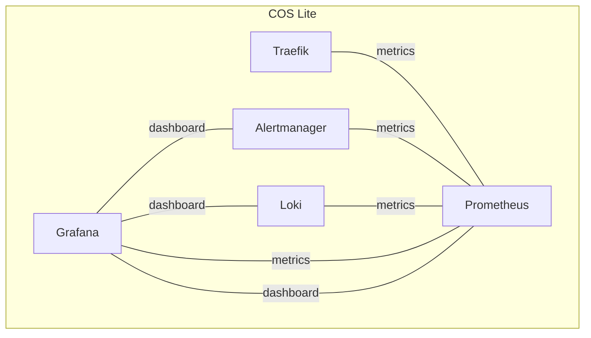

sed-i | 2024-04-15 20:41:43 UTC | #1

A COS Lite deployment is made up of numerous juju relation.

For clarity and readability, the bundle topology is depicted here using several separate diagrams. Each line indicates a separate juju relation.

## Ingress view
The workloads that make up COS Lite are servers that need to be reachable from outside the model they are deployed in.
- Grafana ("ingress-to-leader") is the main UI, amalgamating telemetry from all datasources into dashboards.
- Prometheus and Loki (both "ingress-per-unit"), ingest telemetry pushed from grafana agent from another model.
- Alertmanager ("ingress per app"), has a UI for acknowledging or silencing alerts.

## Datasource view
The workloads that make up COS Lite are datasources for each other:
- Grafana queries loki, prometheus for telemetry and alertmanager for alerts.
- Promtetheus and loki evaluate alert rules and post alerts to alertmanager.

## Self-monitoring view
We need to be made aware if the observability solution itself is functioning properly. Self-monitoring relations within COS Lite, together with [cos-alerter](https://github.com/canonical/cos-alerter), are meant to alert for outages of the observability stack itself.

-------------------------

